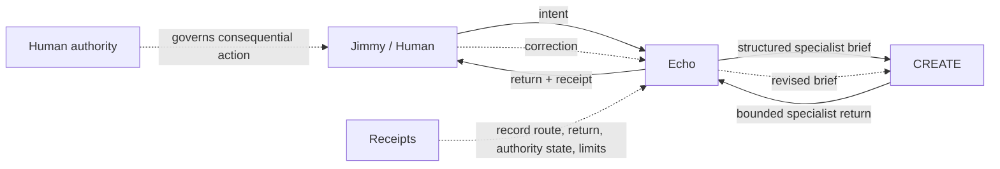

# Genie Lite Architecture

## Judge path in 30 seconds

## Core distinction

Echo is the conversational bridge. CREATE is the specialist. The human remains the authority boundary.

Genie Lite is designed to make these separations inspectable:

- conversation does not equal authority
- routing does not equal execution
- execution does not equal verification
- recovery does not equal permission to resume
- a correction must materially change the next specialist brief/result

## Frozen seam

> **JIMMY → ECHO → CREATE → ECHO → JIMMY**

## Consequential extension

The broader governed pattern is:

> **HUMAN → ECHO → CREATE → GOVERNANCE → HUMAN AUTHORIZE → ACTION → VERIFY → RECEIPT → ECHO → HUMAN**

The contest specimen intentionally proves only the bounded Echo→CREATE seam plus authority, correction, receipt, and recovery rules. It does not claim the whole larger system is implemented.

## Runtime

- framework: Strands
- hosting/runtime: Amazon Bedrock AgentCore
- build: CodeZip
- model: `amazon.nova-pro-v1:0`
- region: `us-east-1`
- managed memory: not configured
- deployed runtime state: READY

## Evidence boundary

The deterministic suite proves the local mechanism. AgentCore deployment proves the runtime exists and is READY. The successful deployed normal/correction model trace remains an evidence upgrade until a provider invocation completes without throttling.
