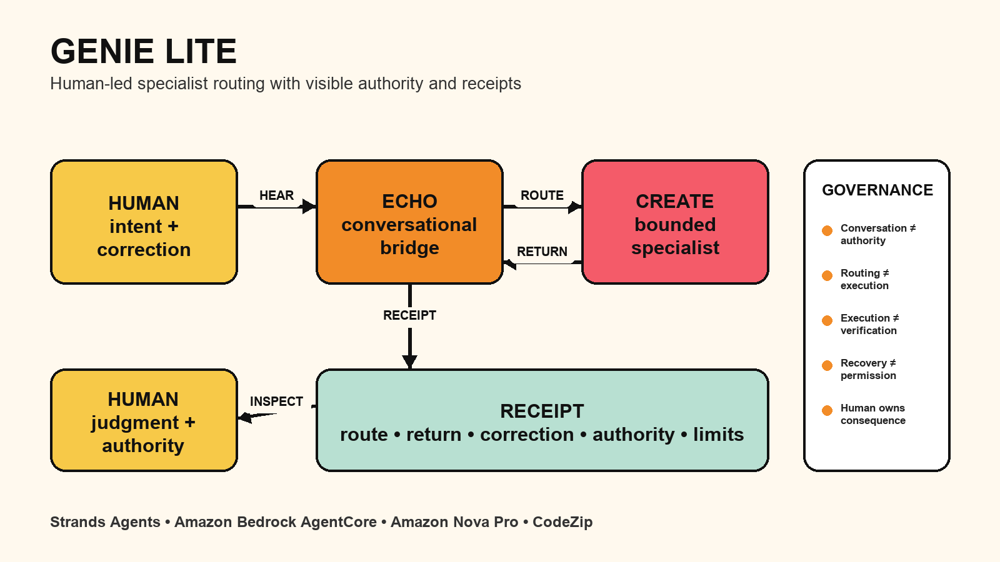
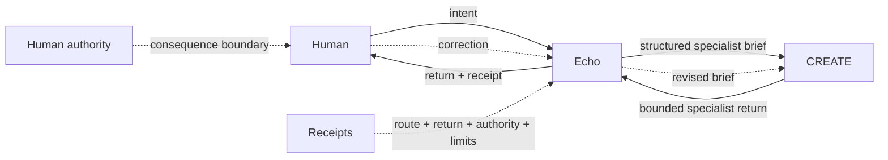

# Genie Lite Architecture

## Judge path in 30 seconds

## Core idea

Genie Lite keeps three roles separate:

1. **Human** — sets intent, corrects direction, and owns consequential authority.
2. **Echo** — receives the request, carries context, routes specialist work, and returns results.
3. **CREATE** — performs one bounded specialist task behind a visible route.

The contest seam is:

> **HUMAN → ECHO → CREATE → ECHO → HUMAN**

## What makes the design different

Genie Lite treats these distinctions as first-class behavior:

- conversation does not equal authority
- routing does not equal execution
- execution does not equal verification
- recovery does not equal permission to resume
- a correction must materially change the next specialist brief/result
- receipts expose what happened and what remains unproved

## Runtime architecture

- **Framework:** Strands Agents
- **Runtime:** Amazon Bedrock AgentCore
- **Model:** Amazon Nova Pro (`amazon.nova-pro-v1:0`)
- **Deployment:** AgentCore CodeZip
- **Region:** `us-east-1`
- **Managed memory:** intentionally not configured for this contest specimen
- **Runtime state:** deployed / `READY`

## Recovery / authority rule

Useful state may be recovered after interruption, but stale consequential authority is not automatically restored.

That allows continuity without turning a remembered conversation into silent permission to act.

## Evidence boundary

The deterministic suite proves the routing, correction, receipt, and recovery/authority mechanism. AgentCore deployment proves that the runtime exists and reports `READY`.

The first deployed Nova invocation was throttled by the provider daily-token quota, so a successful deployed normal/correction conversation is not claimed until it is actually observed.

See [`EVIDENCE_AND_CLAIM_FENCE.md`](EVIDENCE_AND_CLAIM_FENCE.md) for the public truth table.
